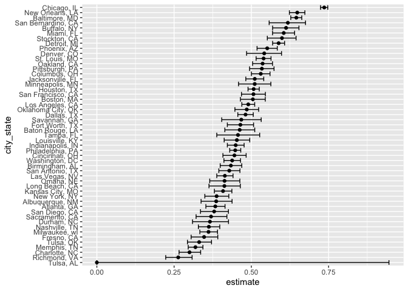
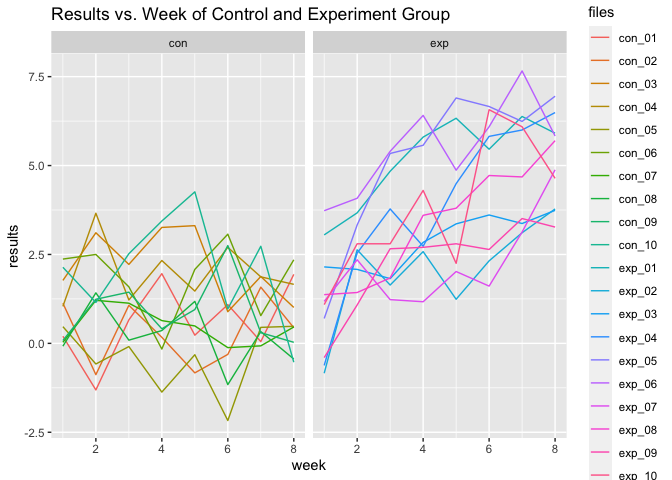
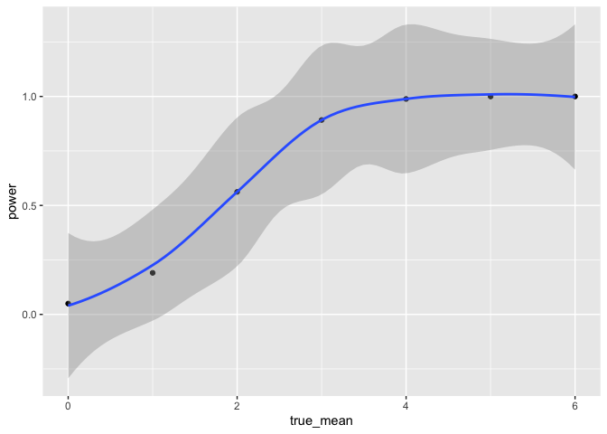
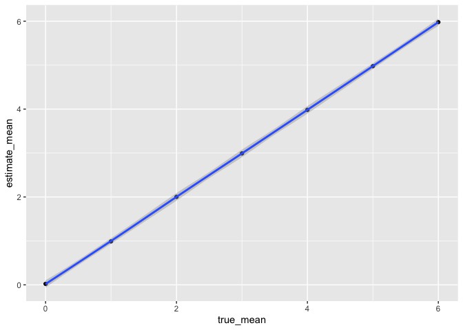
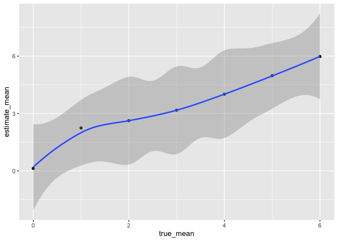

p8105_hw5_qc2336
================
2023-11-07

``` r
library(tidyverse)
```

    ## ── Attaching core tidyverse packages ──────────────────────── tidyverse 2.0.0 ──
    ## ✔ dplyr     1.1.3     ✔ readr     2.1.4
    ## ✔ forcats   1.0.0     ✔ stringr   1.5.0
    ## ✔ ggplot2   3.4.3     ✔ tibble    3.2.1
    ## ✔ lubridate 1.9.3     ✔ tidyr     1.3.0
    ## ✔ purrr     1.0.2     
    ## ── Conflicts ────────────────────────────────────────── tidyverse_conflicts() ──
    ## ✖ dplyr::filter() masks stats::filter()
    ## ✖ dplyr::lag()    masks stats::lag()
    ## ℹ Use the conflicted package (<http://conflicted.r-lib.org/>) to force all conflicts to become errors

``` r
library(dplyr)
library(rvest)
```

    ## 
    ## Attaching package: 'rvest'
    ## 
    ## The following object is masked from 'package:readr':
    ## 
    ##     guess_encoding

``` r
library(purrr)
library(ggplot2)
library(patchwork)
```

## Problem 1

``` r
homicide=read_csv(file = "./data/homicide-data.csv")
```

    ## Rows: 52179 Columns: 12
    ## ── Column specification ────────────────────────────────────────────────────────
    ## Delimiter: ","
    ## chr (9): uid, victim_last, victim_first, victim_race, victim_age, victim_sex...
    ## dbl (3): reported_date, lat, lon
    ## 
    ## ℹ Use `spec()` to retrieve the full column specification for this data.
    ## ℹ Specify the column types or set `show_col_types = FALSE` to quiet this message.

``` r
homicide
```

    ## # A tibble: 52,179 × 12
    ##    uid        reported_date victim_last  victim_first victim_race victim_age
    ##    <chr>              <dbl> <chr>        <chr>        <chr>       <chr>     
    ##  1 Alb-000001      20100504 GARCIA       JUAN         Hispanic    78        
    ##  2 Alb-000002      20100216 MONTOYA      CAMERON      Hispanic    17        
    ##  3 Alb-000003      20100601 SATTERFIELD  VIVIANA      White       15        
    ##  4 Alb-000004      20100101 MENDIOLA     CARLOS       Hispanic    32        
    ##  5 Alb-000005      20100102 MULA         VIVIAN       White       72        
    ##  6 Alb-000006      20100126 BOOK         GERALDINE    White       91        
    ##  7 Alb-000007      20100127 MALDONADO    DAVID        Hispanic    52        
    ##  8 Alb-000008      20100127 MALDONADO    CONNIE       Hispanic    52        
    ##  9 Alb-000009      20100130 MARTIN-LEYVA GUSTAVO      White       56        
    ## 10 Alb-000010      20100210 HERRERA      ISRAEL       Hispanic    43        
    ## # ℹ 52,169 more rows
    ## # ℹ 6 more variables: victim_sex <chr>, city <chr>, state <chr>, lat <dbl>,
    ## #   lon <dbl>, disposition <chr>

> > The raw data has 52170 observations and 12 variables, including a
> > unique id. The date, the victim’s information, where is has happened
> > and the result.

``` r
homicide=homicide|>
  mutate(city_state=str_c(city,state,sep=", "),
         state = replace(state, state == "wI", "WI"),)
```

``` r
homicide_n=homicide|> 
  group_by(city_state) |>
  summarize(
    total_homicides = n(),
    unsolved_homicides = sum(disposition %in% "Open/No arrest") + sum(disposition %in% "Closed without arrest")) |>
  tibble()

homicide_n
```

    ## # A tibble: 51 × 3
    ##    city_state      total_homicides unsolved_homicides
    ##    <chr>                     <int>              <int>
    ##  1 Albuquerque, NM             378                146
    ##  2 Atlanta, GA                 973                373
    ##  3 Baltimore, MD              2827               1825
    ##  4 Baton Rouge, LA             424                196
    ##  5 Birmingham, AL              800                347
    ##  6 Boston, MA                  614                310
    ##  7 Buffalo, NY                 521                319
    ##  8 Charlotte, NC               687                206
    ##  9 Chicago, IL                5535               4073
    ## 10 Cincinnati, OH              694                309
    ## # ℹ 41 more rows

``` r
hom_unsolved=homicide_n|>
  filter(city_state%in% "Baltimore, MD")|>
  mutate(prop_test = map2(unsolved_homicides, total_homicides, ~prop.test(.x, .y)|>
                            broom::tidy()))  |>
  unnest()|>
  select(city_state, estimate, conf.low,  conf.high)
```

    ## Warning: `cols` is now required when using `unnest()`.
    ## ℹ Please use `cols = c(prop_test)`.

``` r
hom_unsolved
```

    ## # A tibble: 1 × 4
    ##   city_state    estimate conf.low conf.high
    ##   <chr>            <dbl>    <dbl>     <dbl>
    ## 1 Baltimore, MD    0.646    0.628     0.663

``` r
all_unsolved=homicide_n|>
  mutate(prop_test = map2(unsolved_homicides, total_homicides, ~prop.test(.x, .y)|>
                            broom::tidy()))  |>
  unnest()|>
  select(city_state, estimate, conf.low,  conf.high)
```

    ## Warning: There was 1 warning in `mutate()`.
    ## ℹ In argument: `prop_test = map2(...)`.
    ## Caused by warning in `prop.test()`:
    ## ! Chi-squared approximation may be incorrect

    ## Warning: `cols` is now required when using `unnest()`.
    ## ℹ Please use `cols = c(prop_test)`.

``` r
all_unsolved
```

    ## # A tibble: 51 × 4
    ##    city_state      estimate conf.low conf.high
    ##    <chr>              <dbl>    <dbl>     <dbl>
    ##  1 Albuquerque, NM    0.386    0.337     0.438
    ##  2 Atlanta, GA        0.383    0.353     0.415
    ##  3 Baltimore, MD      0.646    0.628     0.663
    ##  4 Baton Rouge, LA    0.462    0.414     0.511
    ##  5 Birmingham, AL     0.434    0.399     0.469
    ##  6 Boston, MA         0.505    0.465     0.545
    ##  7 Buffalo, NY        0.612    0.569     0.654
    ##  8 Charlotte, NC      0.300    0.266     0.336
    ##  9 Chicago, IL        0.736    0.724     0.747
    ## 10 Cincinnati, OH     0.445    0.408     0.483
    ## # ℹ 41 more rows

``` r
all_unsolved|>
  mutate(city_state = fct_reorder(city_state, estimate))|>
  ggplot(aes(y=city_state, x=estimate))+
  geom_point()+
  geom_errorbar(aes(xmin = conf.low, xmax = conf.high))
```

<!-- -->

## Problem 2

``` r
long_data=tibble(files = list.files("data/data 2/"),
    path = str_c("data/data 2/",files))|>
  mutate(data = map(path, read_csv)) |>
  unnest()
```

    ## Warning: `cols` is now required when using `unnest()`.
    ## ℹ Please use `cols = c(data)`.

``` r
tidy_long=long_data|>
  mutate(files=str_replace(files,".csv",""),
         group = str_sub(files, 1, 3))|>
  pivot_longer(week_1:week_8,
               names_to = "week",
               values_to = "results",
               names_prefix = "week_")|>
  mutate(week=as.numeric(week))|>
  select(-path)


tidy_long
```

    ## # A tibble: 160 × 4
    ##    files  group  week results
    ##    <chr>  <chr> <dbl>   <dbl>
    ##  1 con_01 con       1    0.2 
    ##  2 con_01 con       2   -1.31
    ##  3 con_01 con       3    0.66
    ##  4 con_01 con       4    1.96
    ##  5 con_01 con       5    0.23
    ##  6 con_01 con       6    1.09
    ##  7 con_01 con       7    0.05
    ##  8 con_01 con       8    1.94
    ##  9 con_02 con       1    1.13
    ## 10 con_02 con       2   -0.88
    ## # ℹ 150 more rows

``` r
tidy_long|>
  ggplot(aes(x=week, y=results, color=files))+
  geom_line()+
  facet_grid(~group)+
  ggtitle("Results vs. Week of Control and Experiment Group")
```

<!-- -->
\>\> The graph shows significant increase in results over the 8m weeks.
While the result for control stayed relatively the same.

## Problem 3

``` r
t_test = function(mu,n=30, sigma=5) {
  sim_data = tibble( x=rnorm(n=30, mean = mu,sd= sigma))
 
  result=sim_data|>
    t.test() |> 
    broom::tidy() |>
    select(estimate,p.value)
  
  result
}
  
sim_results_df = 
  expand_grid(
    true_mean= 0, 
    iter = 1:5000) |> 
  mutate(
    result = map(true_mean, t_test)) |> 
  unnest(result)
```

``` r
sim_results_mu = 
  expand_grid(
    true_mean= c(0,1,2,3,4,5,6), 
    iter = 1:5000) |> 
  mutate(
    result = map(true_mean, t_test)) |> 
  unnest(result)
```

``` r
## Rejecting  Null
sim_results_mu|>
  filter(p.value<0.05)|>
  group_by(true_mean)|>
  summarize(power=n()/5000)|>
  ggplot(aes(x=true_mean, y=power))+
  geom_point()+
  geom_smooth()
```

    ## `geom_smooth()` using method = 'loess' and formula = 'y ~ x'

<!-- -->
\>\> The power seems to increase as the size increases.

``` r
sim_results_mu|>
  group_by(true_mean)|>
  summarize(estimate_mean=mean(estimate))|>
  ggplot(aes(x=true_mean, y=estimate_mean))+
  geom_point()+
  geom_smooth()
```

    ## `geom_smooth()` using method = 'loess' and formula = 'y ~ x'

<!-- -->

``` r
sim_results_mu|>
   filter(p.value<0.05)|>
  group_by(true_mean)|>
  summarize(estimate_mean=mean(estimate))|>
  ggplot(aes(x=true_mean, y=estimate_mean))+
  geom_point()+
  geom_smooth()
```

    ## `geom_smooth()` using method = 'loess' and formula = 'y ~ x'

<!-- -->

> > The graph is not exactly the same, for null is rejected, there is
> > still a chance where the sample mean is equal to true mean. But it
> > is not equal to true mean at most places.
